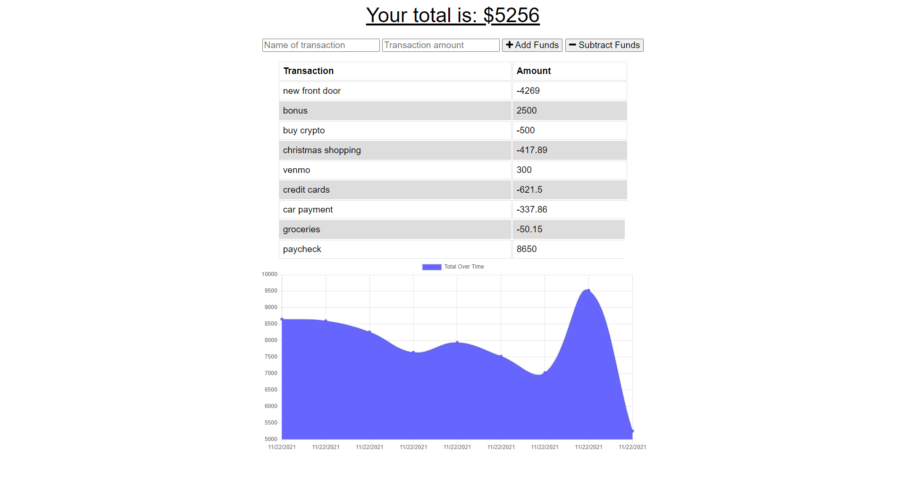

# Track My Budget

## Description

[Deployed Application](https://track-my-budget-app.herokuapp.com/)

We all get busy, and for most of us, tracking our income and expenses can be a hassle. Track My Budget was developed to make this process as straight forward as possible. With this app, you can add your income and expenses on demand and never lose track of your budget.

Sick of using pen and paper or spreadsheets to track your sources of income and expense? Looking for a cleaner way to stay on top of your budget? Then behold the most convenient budget tracker you'll ever use with the Track My Budget app. Did we mention that you can run this app both online and offline. How neat is that?

If you are interested in improving or modifying this application for your own personal usage, please go ahead and clone down the repository and transform it into your own amazing budget tracker.

[Link to video demo of app](https://drive.google.com/file/d/1OTlMpv8sMGRrLNV2szCR-xXwWbcs0xK1/view?usp=sharing)

## Table of Contents

- [Installation](#installation)
- [Usage](#usage)
- [Credits](#credits)
- [License](#license)
- [Features](#features)
- [Examples/Tests](#examples)

## Installation

- While this application is already hosted and running on Heroku, you can also clone this repository down to your local machine and connect the application to your own MongoDB database.

## Usage

- To user the app, simply click the link to the deployed application at the top of the README.

- With the cloned down repository, first open up your command line at the root level of the repository.

- Next, you'll need to install the node packages necessary for this application by running "npm i"

- Once all modules have installed, run "npm run start"

- Finally, navigate to http://localhost:3000/ and start tracking your personal budget!

## Screenshots

### Desktop:

### Mobile:

## Credits

Assets:

+ [express](https://github.com/expressjs/express)

+ [mongoose](https://github.com/Automattic/mongoose)

+ [compression](https://github.com/expressjs/compression)

## License

+ MIT

## Features

+ User is able to view their personal budget

+ User is also able to add expenses and income to update their budget in real time

+ User can add expenses and incomes both online and offline

## How to Contribute

If you would like to contribute to the Track My Budget application, please feel free to clone or fork this repository and implement your desired improvements. Once your improvements have been made and the app has been tested properly, please feel free to send me a message on github with a short summary of the changes you've made and I will invite you to be a collaborator.

## Examples

To see an example for how to use the application and access all of its current features, please refer to the video and gif in the description above.

## Questions

Connect with me on GitHub: [damienluzzo33](https://www.github.com/damienluzzo33)

Shoot me an email: [damienluzzo33@gmail.com](mailto:damienluzzo33@gmail.com)
